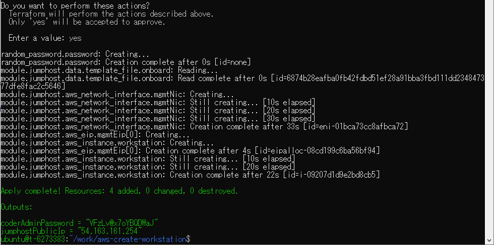
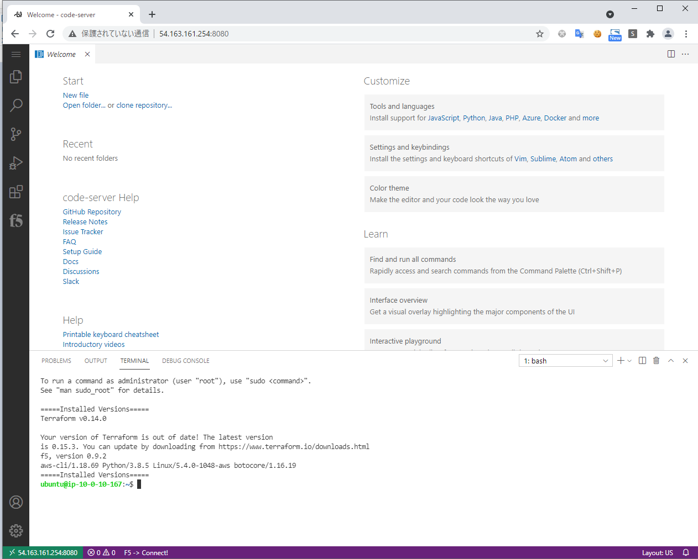

# aws-create-workstation

=====Installed LIST=====  

- terraform  
- f5-cli   
- aws-cli  
- kubectl  
- eksctl  
- helm3

=====Installed LIST=====

## Usage 

```git clone https://....... ```

```vi main.tf```

```bash
module "jumphost" {
  source        = "./workstation"
  coderAccountPassword = random_password.password.result
  projectPrefix = "PrefixName"
  resourceOwner = "OwnerName"
  vpc           = "vpc-aaaaaaaaaaaaa"
  keyName       = "instance key name"
  mgmtSubnet    = "subnet-aaaaaaaaaaaa"
  securityGroup = "sg-aaaaaaaaaaaaa"
}
```
 
```terraform init```

```terraform apply```

```Enter a value: yes```



Listening Code-Server.

URL:  **http://[jumphostPublicIp]:8080**

PASS: **[coderAccountPassword]**


